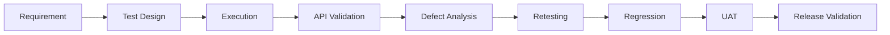
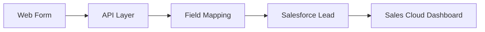
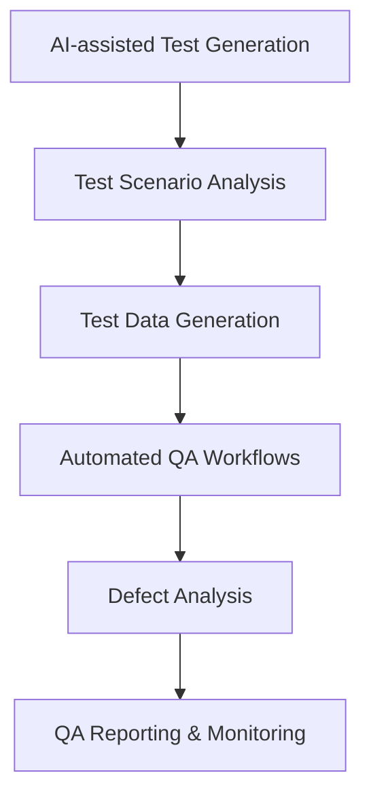

 

  

 

## QUALITY ASSURANCE ENGINEER

**Quality Assurance &nbsp;•&nbsp; Automation &nbsp;•&nbsp; API Testing &nbsp;•&nbsp; E-Commerce &nbsp;•&nbsp; Salesforce**

 

<table>
<tr>

<td width="25%" align="center">

### 🔍
**Testing**

Functional Regression Integration UAT End-to-End

</td>

<td width="25%" align="center">

### 🔌
**API**

REST API Postman JSON Data Validation Integration

</td>

<td width="25%" align="center">

### 🤖
**Automation**

Playwright Selenium Python GitHub Actions

</td>

<td width="25%" align="center">

### ⚡
**Performance**

JMeter PageSpeed Load Testing Response Analysis

</td>

</tr>
</table>

---

## 👨‍💻 Professional Summary

I am a **QA Engineer I at Quick Heal Technologies Ltd**, with hands-on experience in testing web applications, e-commerce platforms, payment workflows, REST APIs, CRM integrations and enterprise applications.

My current work spans **Magento 2, WordPress, Salesforce Sales Cloud, REST APIs and multiple payment gateways**, with a strong focus on end-to-end business workflows and release quality.

I am also exploring **AI agents, AI-assisted testing and workflow automation** to improve QA efficiency and test coverage.

### Quality Lifecycle

---

## 💼 Professional Experience

### QA Engineer I &nbsp;|&nbsp; Quick Heal Technologies Ltd
`Jun 2026 – Present` &nbsp;•&nbsp; 📍 Pune, India

<b>E-Commerce & Application Testing</b>

 

- Testing Magento 2 based e-commerce applications and CRM-integrated web applications.
- Performing Functional, Regression, Integration, System, UAT, API and Compatibility Testing.
- Testing complete e-commerce journeys: products, variants, pricing, cart, checkout, payments, orders, renewals and auto-renewal.

<b>Payments & API Validation</b>

 

- Testing payment workflows across **PhonePe, Razorpay, Comviva, Stripe and Adyen**.
- Performing REST API testing using **Postman**.
- Validating merchant order IDs, transaction IDs, payment status, amount mapping and order reconciliation.
- Testing **Comviva Fresh Purchase, Renewal and Auto-Renewal** workflows.
- Validating recurring payment workflows and notification processing.

<b>Enterprise & CRM Integration</b>

 

- Testing **Seqrite WordPress enterprise lead-generation workflows**.
- Validating **Web-to-Salesforce** integrations, field mapping, synchronisation and Lead creation.
- Testing Salesforce Sales Cloud dashboards for Retail and Enterprise applications.
- Using SQL for application and business-data validation.

<b>Automation, Performance & Release</b>

 

- Creating Playwright automation scripts for critical regression scenarios.
- Performing performance and load testing using JMeter.
- Using Chrome DevTools, Lighthouse and network analysis for troubleshooting.
- Managing defects through Jira and supporting UAT, production verification and release validation.

 

### QA Intern &nbsp;|&nbsp; Quick Heal Technologies Ltd
`Jun 2025 – Jun 2026` &nbsp;•&nbsp; 📍 Pune, India

<b>View responsibilities</b>

 

- Supported QA activities for the Magento website revamp.
- Performed Functional, Regression, Integration and Compatibility Testing.
- Tested product pages, variants, pricing, cart, checkout and payment workflows.
- Created Playwright automation scripts for regression scenarios.
- Performed API testing using Postman and executed JMeter load testing.
- Performed UAT and post-deployment validation.
- Investigated issues using browser Developer Tools, network requests and API responses.
- Reported defects, performed retesting and supported release validation.

---

## 🧪 QA Engineering Stack

**Manual Testing** 

  

**Automation** 

  

**API & Database** 

  

**Performance & Diagnostics** 

  

**Project & Defect Management** 

---

## 💳 Payment Gateway Testing

 

| Workflow | Validation Focus |
|:--|:--|
| **Payment Initiation** | Request, amount and transaction data |
| **Success** | Payment status and order creation |
| **Failure** | Error handling and state validation |
| **Cancellation** | Payment state and order behaviour |
| **Timeout** | Retry and failure handling |
| **Redirect** | Gateway-to-application flow |
| **UPI** | QR and UPI payment scenarios |
| **Renewal** | Existing subscription and payment flow |
| **Auto-Renewal** | Recurring payment processing |
| **Reconciliation** | Transaction and order matching |

---

## ☁️ Salesforce & Enterprise QA

### Integration Flow

### Enterprise QA Areas

| Area | Scope |
|:--|:--|
| **Lead Integration** | Web-to-Salesforce lead creation |
| **API Validation** | Payload and response data validation |
| **Data Integrity** | Field mapping and data synchronisation |
| **Workflows** | Retail and Enterprise lead workflows |
| **Reporting** | Dashboard and CRM data validation |

---

## 🤖 AI in QA

### Areas of Exploration

---

## 📊 GitHub Analytics

 

  

---

## 🤝 Connect

I welcome conversations on **quality engineering, test automation, API testing and AI-assisted QA**.

 

